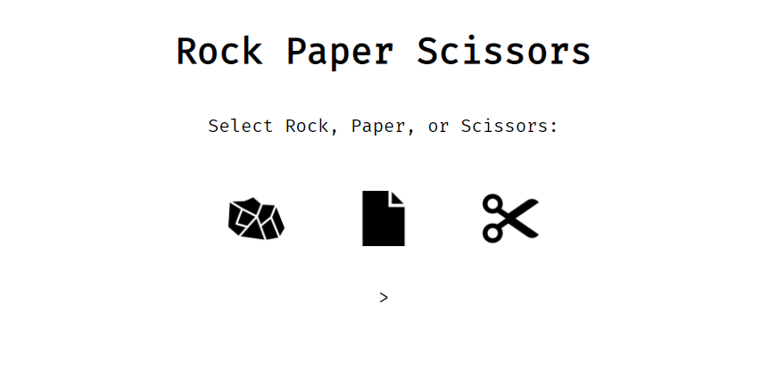

# Challenge Project: Rock, Paper, Bundle

## General Info

>*In this off-platform project, we will apply Webpack to a finished project. We will use a web app for a Rock Paper Scissors game that currently doesn’t have any build tools.*

----

A project for configuring an existing web application to use Webpack

This project is part of Codecademy front-end course.

## Technologies
- Webpack v5.75.0
- Webpack-cli v5.0.0
- Webpack-dev-server v4.11.1
- Html-webpack-plugin v5.5.0 
- Css-loader v6.7.2
- Style-loader v3.3.1

## Launch

- Made to compile localy with Webpack

### Screenshot

